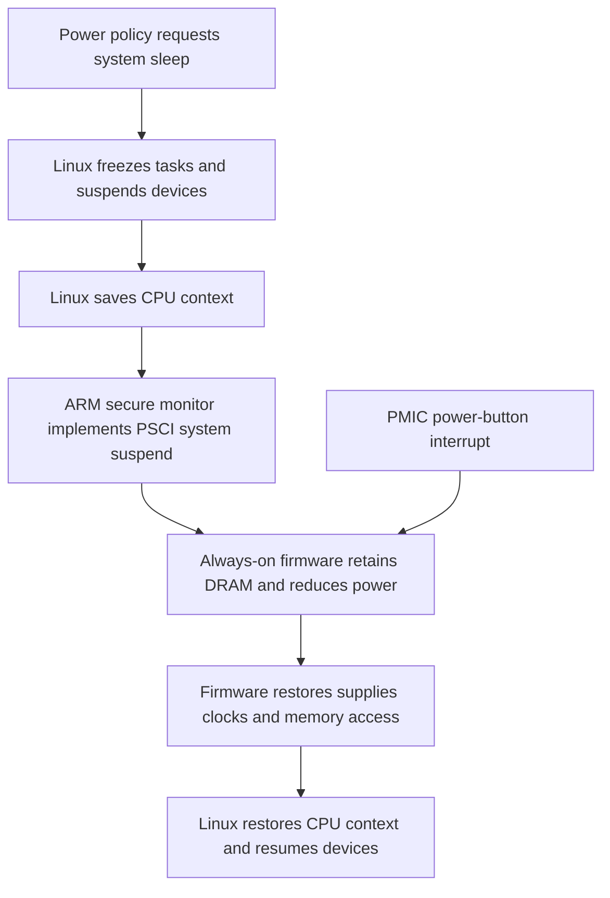

# Sleep and wake feasibility on GameShell CPI v3.1

Research date: 27 September 2026. Scope: source inspection for the owner's R16/A33-family board, following [the agreed requirements](06-base-requirements.md). No image was built, suspend command executed, or device setting changed. Hardware revision and installed boot firmware still require confirmation.

Local-document supplement: [report 14](14-vendor-suspend-and-memory-evidence.md) adds direct R16 vendor descriptions of super standby, ARISC and DRAM self-refresh controls. This strengthens the firmware investigation's hardware basis; the full retention/resume implementation remains missing from the supplied documents. The source audit below remains the record of the examined upstream code.

Subsequent source trace: [report 17](17-vendor-firmware-and-dram-trace.md) locates actual A33 DRAM operations and historical ARM/ARISC code; [report 19](19-modern-suspend-integration.md) identifies existing downstream ARMv7 PSCI/SCPI integration and further Crust gaps. The stock-upstream findings below still stand, but monitor integration is now an audit/rebase candidate rather than wholly new work. See [the implementation plan](20-base-implementation-plan.md) for the current recommendation.

## Decision supported by the evidence

**Reliable suspend-to-idle is a reasonable first implementation milestone. Deep suspend with DRAM retention is a separate firmware-development question, not an established feature that we can obtain by selecting Armbian or enabling Crust.** The examined Linux, U-Boot and Crust sources contain useful pieces, but do not provide a complete, verified GameShell suspend-to-RAM path. A week of standby and sub-second resume remain targets requiring measurements. This conclusion follows from the concrete gaps below; it is not a claim that the hardware cannot achieve deeper sleep.

Use maintained **6.18.y** as the initial kernel candidate, with **6.12.y** as a comparison/fallback baseline. The sleep audit establishes no reason to expect that choosing 6.12 alone resolves the firmware gap. Kernel.org currently lists both series through December 2028. This audit examines fixed upstream **v6.12** and selected **v6.18** files, **U-Boot v2026.07**, and **Crust `499a362645e6ce6ac1fd8ea8d0f25d4df6690688`**. It does not certify every change in subsequent stable point releases or a distribution patch collection. Freeze and review the actual versions before a build. [Kernel support schedule][kernel-releases]; [Linux source snapshots][linux612]; [v6.18 snapshot][linux618]; [U-Boot snapshot][uboot]; [Crust snapshot][crust].

In the targeted v6.12/v6.18 comparison, `sun8i-a33.dtsi`, `sun8i-a23-a33.dtsi`, the sunxi machine descriptor and `axp20x-pek.c` are byte-identical. The newer PSCI source still gates system-suspend registration on firmware support. Neither comparison removes the central blocker below. [v6.18 A33 DTS][a33-618]; [v6.18 shared DTS][a23-a33-618]; [v6.18 power key][pek-618]; [v6.18 PSCI][psci-618].

## 1. Distinguish the power states before evaluating them

| State | What source inspection establishes | GameShellNeo implication |
| --- | --- | --- |
| Awake idle | CPU frequency scaling and architectural CPU idle are separate from system sleep. The A33 DTS contains CPU operating points, but no deeper CPU idle-state descriptions. | Optimize awake efficiency independently; a low CPU frequency does not demonstrate low standby consumption. |
| Screen off | Panel and backlight control can stop visible output without suspending the operating system. | Useful for debugging and measurement, but insufficient to meet the requested sleep behavior by itself. |
| Suspend-to-idle (`s2idle`/`freeze`) | Linux can freeze tasks, suspend devices and wait in its idle loop without platform `suspend_ops`. | An incremental way to qualify peripheral recovery and power-button wake before firmware work. Success and power savings remain untested for the new base on the owner's device. |
| Platform suspend-to-RAM (`deep`) | The Linux platform entry needs a suspend implementation. The examined PSCI path requires firmware to advertise `SYSTEM_SUSPEND`. | Missing firmware support cannot be supplied by changing userspace policy or writing `deep` to sysfs. |

Sources: [A33 CPU description][a33]; [Linux system-suspend implementation][suspend-core]; [PSCI system-suspend implementation][psci]; [original display implementation][display]. These names describe mechanisms, not guaranteed power consumption. In particular, `mem` in `/sys/power/state` is not by itself proof of deep sleep: inspect `/sys/power/mem_sleep` and the selected state. The kernel initializes suspend-to-idle separately from platform sleep states. [Suspend-state initialization][suspend-core].

The upstream PSCI cpuidle driver expects a PSCI CPU enable method, a usable CPU-suspend operation and additional device-tree idle states. It deliberately declines registration when only architectural WFI is available. The inherited A23/A33 CPU description instead starts with an Allwinner-specific enable method; a bootloader can amend the live tree. Therefore neither an enabled `CONFIG_CPU_IDLE` nor a boot log mentioning PSCI establishes deep CPU idle. Capture the live device tree and actual `cpuidle` state directories. [PSCI cpuidle driver][cpuidle]; [A23/A33 description][a23-a33].

## 2. The missing deep-sleep entry path

The standard path we would like to support is:

This is a **proposed integration**, not a diagram of working GameShell firmware. Linux's `psci_system_suspend_enter()` saves context through `cpu_suspend()`, and its finisher invokes `SYSTEM_SUSPEND` with the physical Linux resume address. `psci_init_system_suspend()` installs the platform operations only if that firmware feature is available. The examined sunxi machine descriptor does not install an alternative A33 system-suspend implementation. [PSCI implementation][psci]; [sunxi platform code][sunxi-platform].

In U-Boot v2026.07, the sunxi ARMv7 implementation supplies CPU power-on and power-off machinery for secondary CPUs. It does **not** override the generic weak `psci_cpu_suspend` or `psci_system_suspend` functions, which return “not implemented.” CPU hotplug or successful multicore boot therefore does not prove system sleep support. A replacement secure-monitor suspend implementation, or another deliberately designed platform entry, remains necessary for this route. [Sunxi PSCI implementation][uboot-psci]; [generic ARMv7 PSCI fallback][uboot-psci-fallback].

The commonly documented **TF-A + Crust** integration is for A64/H5/H6-class 64-bit systems. U-Boot's `SUNXI_SCP_BASE` selects load addresses for those families and otherwise defaults to zero. Crust's ABI also distinguishes the SRAM layout on 32-bit platforms from platforms using TF-A. Those are reasons to design and audit an R16-specific loading/monitor arrangement; copying a PinePhone or A64 build recipe does not establish it. [U-Boot SCP configuration][uboot-kconfig]; [U-Boot sunxi64 instructions][uboot-sunxi64]; [Crust ABI][crust-abi].

## 3. Crust has genuine A33 support, with a decisive limitation

Crust's support table lists A33 as **known to run**, with SCPI, CPU-core, CPU-subsystem and PMIC support, but **no DRAM support**. Its source agrees with the table:

- The A23/A33 platform does not select `HAVE_DRAM_SUSPEND`.
- The DRAM Makefile selects implementations for A64, H3 and H6, with no A23/A33 implementation.
- The generic `dram_suspend()` and `dram_resume()` implementations are empty weak functions.
- `select_suspend_depth()` returns `SD_NONE` when `HAVE_DRAM_SUSPEND` is absent.

Sources: [Crust support matrix][crust-readme]; [platform configuration][crust-platform]; [DRAM build selection][crust-dram-make]; [DRAM fallbacks][crust-dram]; [system state machine][crust-system]. This is strong evidence for a useful partial platform port, **not** for an already available deep-sleep solution. `SD_NONE` is a firmware depth choice; it does not mean the other CPU power-management work does nothing.

The missing memory work is substantive. A working implementation must quiesce memory users, retain memory contents, manage controller/PHY state and clocks, and restore access before the ARM CPU resumes executing from DRAM. Crust's implemented H3/A64 path illustrates the ordering: disable controller access, request self-refresh, wait for confirmation, handle PHY state, gate clocks, then reverse the sequence. Those register values cannot be presumed correct for A33. [Implemented DRAM suspend example][crust-dram-example].

There is also an actionable clock-integration issue. The examined Linux A23/A33 DTS models AR100 as a fixed-factor child of the 24 MHz oscillator. In a first-party December 2022 discussion, Crust developer Samuel Holland explains that his A23/A33 port changes AR100 to the internal oscillator and that the inaccurate Linux model then gives the RSB controller an incorrect divider. The same fixed-factor description remains in the compared v6.12 and v6.18 files. **Clock-model compatibility must be resolved before trusting PMIC accesses with Crust running.** This is a source-based risk assessment, not a reproduced fault on the owner's device. [Linux clock description][a23-a33]; [developer explanation][clock-discussion].

The newly supplied **R16 datasheet revision 1.4** helps establish the hardware's independent CPU power domain, DVFS, memory frequency scaling and component clock-gating capabilities. Its 30 pages are an electrical/features datasheet, not a controller register manual or a suspend sequence. [R16 datasheet, pages 6–7 and contents][r16-datasheet].

A separate **R16 user manual revision 1.2** was located during this investigation. Its inspected contents list power management on page 24 and CPUCFG registers on pages 85–93, but list only an SDRAM overview on page 266 before the NAND chapter. Subsequent fetches failed, so this report does not claim a completed audit of those sections or a complete DRAM register specification. Review that manual and the published **A33 user manual** against working code and the actual memory parts before designing retention firmware. [R16 user manual, contents][r16-manual]; [A33 user manual][a33-manual].

### Historical proof is useful, but not production support

Lawrence Yu's 2017 first-person A33 work reports suspend/resume on tablets and a Sinlinx board using code adapted from Allwinner's vendor kernel. It required binary ARISC firmware, device-specific DRAM parameters and U-Boot/kernel changes. His notes identify clock workarounds, immediate wakes at full battery and USB/Wi-Fi resume workarounds. This supports **physical feasibility on related A33 systems**; it does not validate CPI v3.1, a modern kernel or the requested latency/endurance. Treat it as a map of experiments and failure modes, in accordance with the owner's preference to use historical code as guidance. [Author's announcement][historical-announcement]; [implementation notes][historical-notes].

### GameShell-specific evidence: working light sleep in 2020

Joao_Manoel's May 2020 GameShell experiment reports RTC wake and later power-button wake using smaeul's `patch/irqchip-v2` branch with a 5.7-rc5-based kernel. Crucially, his `mem_sleep` contained only `[s2idle]`. He reports roughly three seconds to resume and immediate shutdown caused by the wake press reaching userspace as `KEY_POWER`; his workaround mapped PMIC short/long events to suspend/power keys. This establishes historical board-specific light sleep and a duplicate-event failure mode, not modern deep-sleep support or measured performance on our device. [First-person standby report][gameshell-standby].

The inspected battery plot puts the freezing curve above the awake screen-off curve. Its software readings, periodically interrupted sleep and different battery/configuration make it comparison evidence rather than a GameShellNeo endurance forecast. No current, capacity or runtime estimate is adopted from the chart. The post's AR100-absence conjecture and guessed deep-resume delay were not demonstrated results and are not adopted. [Experiment and method][gameshell-standby]; [original graph][gameshell-standby-graph].

In an August 2018 predecessor discussion, hal described an earlier attempt abandoned over unacceptable drain and a closed coprocessor dependency. That is first-hand project history, without a reproducible current build or characterized measurement method; it does not predict GameShellNeo runtime. [Original discussion, post 3][gameshell-suspend-history].

There is positive source evidence for treating R16 as A33-compatible: upstream Linux's R16 Nintendo NES Classic DTS includes `sun8i-a33.dtsi` and declares both compatible strings, while U-Boot selects `CONFIG_MACH_SUN8I_A33` for that R16 board. ClockworkPi's own CPI DTS also uses the A33 description. Combined with Crust's actual A33 port, these justify investigating the AR100 route rather than assuming missing hardware. They do not establish a working firmware image on this owner's board or prove every silicon detail identical. The demonstrated implementation gaps remain monitor integration, clocks and DRAM retention. [Upstream R16 DTS][r16-upstream-dts]; [U-Boot R16 configuration][r16-uboot-config]; [CPI DTS][board-dts]; [Crust A33 configuration][crust-platform].

## 4. The power-button wake chain already has useful upstream support

The original CPI board description routes the AXP223 interrupt through `r_intc`, using SPI 32 and a low-level trigger at the PMIC input. The inherited A23/A33 tree describes the always-on interrupt controller and its upstream connection. This gives a concrete candidate wake route:

**Power key → AXP223 interrupt status/mask → PMIC interrupt line → R_INTC → CPU/firmware wake.** [ClockworkPi board DTS][board-dts]; [A23/A33 interrupt topology][a23-a33].

The software chain is meaningful rather than just a device-tree label:

| Component | Examined behavior |
| --- | --- |
| `axp20x-pek` | Registers an input power key, enables device wake by default and calls `enable_irq_wake()` for its falling/rising-edge interrupts during suspend. |
| Regmap interrupt framework | Propagates child wake requests to the parent interrupt. |
| `irq-sun6i-r` | Records supported wake interrupts and programs wake-enable masks in its system-core suspend callback. |
| `sunxi-rsb` | Has late suspend/early resume handling that shuts down and reinitializes the PMIC bus hardware. |

Sources: [power-key driver][pek]; [regmap interrupt framework][regmap-irq]; [always-on interrupt controller][r-intc]; [RSB driver][rsb]. Firmware must still preserve and act on the resulting wake configuration for deep sleep. Test both battery and USB-powered cases, and check press/release events across the transition.

**Do not carry forward the old power-button patch unchanged.** ClockworkPi remapped edge resources to short/long-press events, then synthesized a key press and release around a 100 ms sleep in the handler. Upstream uses the actual edges. For the requested short-press sleep policy, start with upstream semantics and test them on the board. Also test that the wake press is not immediately interpreted as a new sleep request; the examined driver's special resume suppression applies to AXP288, not this AXP223. [Historical patch][power-patch]; [upstream key handling][pek].

Battery warning wake is a different integration. In v6.12 the MFD IRQ table names AXP22x low-power levels, but its AXP223 battery child has no interrupt resources, and the battery driver neither requests those IRQs nor establishes a wake callback. A userspace low-battery monitor cannot run while tasks are frozen. Thus power-button wake support does **not** establish orderly critical-battery shutdown during sleep. The battery investigation must choose and validate a warning/wake path, a bounded sleep strategy, or another explicit policy; PMIC emergency cutoff is not an orderly Linux shutdown. [AXP223 MFD resources][axp-mfd]; [battery driver][battery].

The AXP223 vendor datasheet does identify low-power battery alarms among its sleep/wake sources, providing a hardware lead for that work. Its PMIC sleep mechanism must still be integrated with the SoC's chosen sleep state and Linux's IRQ handling. The source finding above remains a software gap, not an assertion that the PMIC lacks the capability. [AXP223 datasheet, section 9.1.4][axp-datasheet].

## 5. Peripheral recovery remains part of sleep correctness

| Boundary | Required investigation and acceptance evidence |
| --- | --- |
| LCD, scanout and backlight | Restore the image and brightness without relying on a fresh boot. Upstream `sun4i-drm` uses DRM suspend/resume helpers; the old custom panel and backlight need separate integration review. ClockworkPi's backlight suspend/resume functions are empty. |
| Wi-Fi/SDIO | Since disconnection is acceptable, evaluate powering down the module and reinitializing it. The old DTS requests `keep-power-in-suspend` and always-on Wi-Fi regulators; neither should be removed without mapping shared supplies and recovery behavior. |
| USB keypad and USB gadget | Confirm input returns and the Mac sees a usable network interface again. Distinguish host-side enumeration/reconnection time from local device resume. USB presence must not cause immediate repeated wake when deliberate sleep is requested. |
| Deferred audio, Bluetooth, GPU and HDMI | Deferred functionality does not justify leaving clocks, amplifiers or shared regulators unnecessarily active. Establish safe unused states and their dependencies. |
| microSD and DRAM | Retained application memory, continued storage access and absence of corruption are essential pass criteria, not optional performance checks. |

The first two rows identify concrete source findings; the other rows are **proposed validation requirements** derived from the agreed hardware scope. Sources: [upstream display PM callbacks][sun4i-drm]; [original panel/backlight patch][display]; [board regulator and MMC description][board-dts]; [requirements](06-base-requirements.md). Rewriting a faulty device driver may improve these boundaries, but cannot replace missing system-level memory-retention firmware.

## 6. Recommended sequence and decision gates

1. **Capture the existing installation read-only.** Record bootloader/kernel versions, live DT, `/sys/power/state`, `/sys/power/mem_sleep`, CPU idle/frequency states, power-supply attributes, interrupt counters and enabled wake devices. Preserve its boot log and card. An absent attribute is itself a finding; do not infer capabilities from a historical image label.
2. **Qualify suspend-to-idle on the experimental base.** After a separate build decision, first test device suspend/resume phases, then short actual sleep intervals with serial diagnostics available. Establish reliable power-button wake and local display/keypad recovery before optimizing consumption. Initially isolate Wi-Fi/USB recovery as separate cases.
3. **Characterize consumption without claiming a deep state.** Use repeated, controlled battery-duration tests with fixed brightness, workload and wireless state. Record USB power disconnection and battery uncertainty. Software telemetry during awake intervals cannot by itself prove the electrical state while asleep.
4. **Bound the deeper-firmware experiment.** Before implementing it, document the secure-monitor entry, SRAM ownership, AR100 loading, clock/RSB agreement, memory-controller retention sequence, regulator dependencies and resume entry. Confirm usable A33/R16 register references and the device's DRAM configuration. A new Crust A33 DRAM backend or monitor work may be justified; its size and risk are not yet established as a “small patch set.”
5. **Validate the full experience.** Repeat progressively longer sleeps across battery levels and USB transitions; exercise both radios-off and Wi-Fi-restoration cases; verify memory/storage integrity and critical-battery handling. Report failed cycles as well as successful cycles. Require a substantial repeatable cycle run before advertising reliability.

These are proposed future tests, not commands already run. Read-only capability collection can precede any experimental build; test writes, forced suspend and firmware changes belong to the implementation phase.

Define resume latency as **power-button actuation to a usable local screen/input response**, with Linux resume time, USB re-enumeration and Wi-Fi reconnection recorded separately. Define standby endurance from measured usable battery energy and total suspended drain. The relationship is `standby duration = usable energy / average standby power`; the unverified replacement-battery capacity and absent external meter prevent a credible numerical prediction today. Sub-second resume and week-long standby should remain independently reported targets. These measurement definitions are recommendations implementing [the owner's stated goals](06-base-requirements.md), not hardware performance claims.

**Decision gate:** proceed toward a minimal current-kernel base with testable suspend-to-idle, while keeping deep suspend an explicit engineering investigation. Do not declare the sleep milestone fully satisfied merely because the screen goes dark or a shell returns after one suspend cycle. The central unresolved work is an end-to-end retained-memory path plus proven wake, peripheral recovery and asleep-battery protection.

## Sources

[kernel-releases]: https://www.kernel.org/category/releases.html
[linux612]: https://github.com/torvalds/linux/tree/v6.12
[linux618]: https://github.com/torvalds/linux/tree/v6.18
[uboot]: https://github.com/u-boot/u-boot/tree/v2026.07
[crust]: https://github.com/crust-firmware/crust/tree/499a362645e6ce6ac1fd8ea8d0f25d4df6690688
[a33]: https://github.com/torvalds/linux/blob/v6.12/arch/arm/boot/dts/allwinner/sun8i-a33.dtsi
[a23-a33]: https://github.com/torvalds/linux/blob/v6.12/arch/arm/boot/dts/allwinner/sun8i-a23-a33.dtsi
[a33-618]: https://github.com/torvalds/linux/blob/v6.18/arch/arm/boot/dts/allwinner/sun8i-a33.dtsi
[a23-a33-618]: https://github.com/torvalds/linux/blob/v6.18/arch/arm/boot/dts/allwinner/sun8i-a23-a33.dtsi
[pek-618]: https://github.com/torvalds/linux/blob/v6.18/drivers/input/misc/axp20x-pek.c
[psci-618]: https://github.com/torvalds/linux/blob/v6.18/drivers/firmware/psci/psci.c
[suspend-core]: https://github.com/torvalds/linux/blob/v6.12/kernel/power/suspend.c
[psci]: https://github.com/torvalds/linux/blob/v6.12/drivers/firmware/psci/psci.c
[cpuidle]: https://github.com/torvalds/linux/blob/v6.12/drivers/cpuidle/cpuidle-psci.c
[sunxi-platform]: https://github.com/torvalds/linux/blob/v6.12/arch/arm/mach-sunxi/sunxi.c
[uboot-psci]: https://github.com/u-boot/u-boot/blob/v2026.07/arch/arm/cpu/armv7/sunxi/psci.c
[uboot-psci-fallback]: https://github.com/u-boot/u-boot/blob/v2026.07/arch/arm/cpu/armv7/psci.S
[uboot-kconfig]: https://github.com/u-boot/u-boot/blob/v2026.07/arch/arm/mach-sunxi/Kconfig
[uboot-sunxi64]: https://github.com/u-boot/u-boot/blob/v2026.07/board/sunxi/README.sunxi64
[crust-abi]: https://github.com/crust-firmware/crust/blob/499a362645e6ce6ac1fd8ea8d0f25d4df6690688/docs/abi.md
[crust-readme]: https://github.com/crust-firmware/crust/blob/499a362645e6ce6ac1fd8ea8d0f25d4df6690688/README.md
[crust-platform]: https://github.com/crust-firmware/crust/blob/499a362645e6ce6ac1fd8ea8d0f25d4df6690688/platform/Kconfig
[crust-dram-make]: https://github.com/crust-firmware/crust/blob/499a362645e6ce6ac1fd8ea8d0f25d4df6690688/drivers/dram/Makefile
[crust-dram]: https://github.com/crust-firmware/crust/blob/499a362645e6ce6ac1fd8ea8d0f25d4df6690688/drivers/dram/dram.c
[crust-system]: https://github.com/crust-firmware/crust/blob/499a362645e6ce6ac1fd8ea8d0f25d4df6690688/common/system.c
[crust-dram-example]: https://github.com/crust-firmware/crust/blob/499a362645e6ce6ac1fd8ea8d0f25d4df6690688/drivers/dram/sun8i-h3-dram.c
[clock-discussion]: https://lkml.iu.edu/2212.3/03007.html
[r16-datasheet]: https://linux-sunxi.org/images/b/b3/R16_Datasheet_V1.4_%281%29.pdf
[r16-manual]: https://linux-sunxi.org/images/c/ca/Allwinner_R16_User_Manual_V1.2.pdf
[axp-datasheet]: https://dl.linux-sunxi.org/AXP/AXP223-en.pdf
[a33-manual]: https://dl.linux-sunxi.org/A33/A33%20user%20manual%20release%201.1.pdf
[historical-announcement]: https://groups.google.com/g/linux-sunxi/c/UP6M35hkGMU
[historical-notes]: https://linux-sunxi.org/index.php?title=A33_Suspend&oldid=19979
[gameshell-standby]: https://forum.clockworkpi.com/t/enabling-standby-mode-using-the-power-key/5695
[gameshell-standby-graph]: https://canada1.discourse-cdn.com/flex029/uploads/clockworkpi/original/2X/d/df86a26feb75916a618c771bfa254177babf5fe7.png
[gameshell-suspend-history]: https://forum.clockworkpi.com/t/how-do-i-come-to-suspend/1474/3
[r16-upstream-dts]: https://github.com/torvalds/linux/blob/v6.18/arch/arm/boot/dts/allwinner/sun8i-r16-nintendo-nes-classic.dts
[r16-uboot-config]: https://github.com/u-boot/u-boot/blob/v2026.07/configs/Nintendo_NES_Classic_Edition_defconfig
[board-dts]: ../../GameShell/Code/Kernel/v0.6/515_dts.patch
[power-patch]: ../../GameShell/Code/Kernel/v0.6/515_power.patch
[display]: ../../GameShell/Code/Kernel/v0.6/515_display.patch
[pek]: https://github.com/torvalds/linux/blob/v6.12/drivers/input/misc/axp20x-pek.c
[regmap-irq]: https://github.com/torvalds/linux/blob/v6.12/drivers/base/regmap/regmap-irq.c
[r-intc]: https://github.com/torvalds/linux/blob/v6.12/drivers/irqchip/irq-sun6i-r.c
[rsb]: https://github.com/torvalds/linux/blob/v6.12/drivers/bus/sunxi-rsb.c
[axp-mfd]: https://github.com/torvalds/linux/blob/v6.12/drivers/mfd/axp20x.c
[battery]: https://github.com/torvalds/linux/blob/v6.12/drivers/power/supply/axp20x_battery.c
[sun4i-drm]: https://github.com/torvalds/linux/blob/v6.12/drivers/gpu/drm/sun4i/sun4i_drv.c
