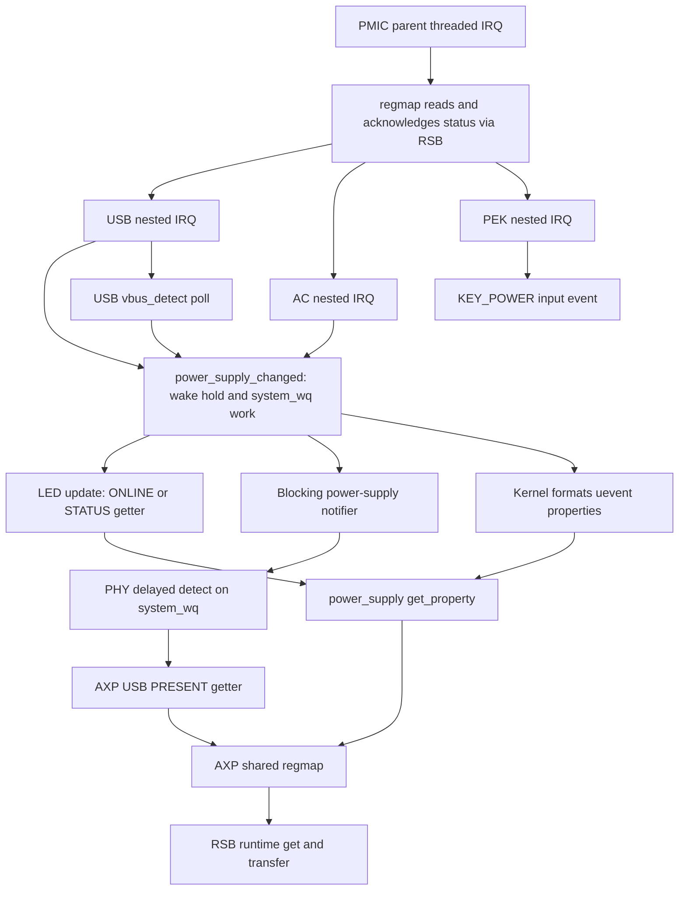

# PMIC suspend ordering audit (NEO-50)

30 September 2026. Source audit of diagnostic.10, Linux
6.18.54-gameshellneo10, and the remaining boundary before RSB noirq shutdown.
The installed image has passed freezer and devices debug stages only. Normal
sleep remains disabled. Nothing in this audit is a measured noirq failure,
physical wake result, actual sleep result or power-saving claim. The hardware
baseline and its limits are recorded in [report 67](67-keypad-port-recovery-comparison.md);
[report 54](54-staged-pm-diagnostic.md) defines the staged diagnostic and
[report 56](56-usb-suspend-work.md) covers the already installed USB poll fix.

## Result

**The existing PM-core protections do not prove exclusive RSB ownership after
the controller's noirq callback.** They order device callbacks, stop userspace
and freezable work, and stop/synchronize the parent PMIC IRQ before noirq. They
do not drain ordinary power-supply notification work or the USB PHY's delayed
detection work. Runtime-PM disable also permits a successful get of a device
whose current and saved runtime states are both active. RSB noirq shutdown
does not change those states or take the transfer mutex. A late worker can
therefore pass that runtime-PM check and attempt a transfer after shutdown.
This is a source-derived reachable interleaving, not a reproduced hardware
fault. The detailed paths and conditions follow. [PM core][pm-main],
[runtime PM][rpm], [RSB][rsb], [power-supply work][psy-core], [PHY][phy].

The bounded repair in [candidate patch 0012](../kernel/patches/0012-sun4i-usb-phy-suspend-work.patch)
disables and drains the PHY detection worker in
ordinary provider suspend, re-enables it with a fresh scan on resume, and moves
its property read behind the existing initialized-state check and mutex.
That closes one independent asynchronous client. It **does not close the
power-supply core's LED/uevent work path**, which remains a prerequisite before
progressing beyond the existing debug stages. The repair passed source-level
native/ARM32 regressions and complete ARM driver compilation in
[report 69](69-usb-phy-suspend-work.md). It is not installed on the GameShell;
the remaining gates below still apply.

## Pinned inputs and actual clients

The authoritative baseline is the local, patched
`.local/sources/linux-6.18.54/` tree, with patches 0001–0011 in the saved build
manifest. [The lock](../build/sources.lock.json) pins upstream commit
`1b357ecb321392158d507b04672ffee57bfa071d`, tag `v6.18.54`, archive SHA-256
`9df30b02dd8102bbd0be52556288ef6889ddbe7f1ddb96fbf847d0becf3eacac`, and
local version `-gameshellneo10`. Line references below are to this baseline,
before applying the new PHY patch; they are not claims about current upstream
master. [Saved patch manifest][manifest], [saved configuration][config].

Reproducibility fingerprints from this audit:

| Input | SHA-256 |
| --- | --- |
| `.local/artifacts/kernel.config` | `d370205bf2e4eed5e35483f15372a6785e7d96252d40c343dfee0b2dde37a017` |
| `.local/artifacts/kernel-patches/manifest.json` | `231679a633d3c2cf02e039413cc4b91a0b5e4f46ba0200fe3575d431e2610c51` |
| Built CPI3 DTB under `.local/build/kernel/arch/arm/boot/dts/allwinner/` | `8b27e81f542f4afefb4be398e52b283e9f12a01fb9a5f3b47068a8b6a9b9c040` |
| Baseline `drivers/phy/allwinner/phy-sun4i-usb.c` | `1410312320d761c364ca6e15eb40099050d7bf9ebaeb5a28070fdf9e46bc5929` |
| Baseline `drivers/power/supply/power_supply_core.c` | `743ddce90195018e1860d0eec42442b6428e1d2db49d26a907fe8628676a7ea7` |
| Baseline `drivers/base/power/runtime.c` | `a20954a2101667f9c72c0f4b0bcb41de917deb65f1d3d6bf5f14472f52a45a30` |

The compiled DTB was read with the build's `scripts/dtc/dtc`, without
modification. It selects AXP223 at `rsb@1f03400/pmic@3a3`; USB, AC and battery
supplies are enabled, ADC is available, and USB0 is peripheral mode with
`usb0_vbus_power-supply` pointing to AXP USB. There is no USB0 VBUS regulator,
ID GPIO or VBUS GPIO property. Thus this board uses the PMIC-property detection
route but does not meet the PHY's continuous self-poll condition (which needs
a polling GPIO or a PHY0 VBUS regulator switched on). Notification-triggered
and initialization scans still exist. [Board DTS, lines 172–184, 253–280][dts],
[AXP include][axp-dtsi], [PHY, lines 402–458, 756–765][phy].

| PMIC client in this build | Access and suspend relevance |
| --- | --- |
| AXP223 MFD / regmap IRQ | Shared regmap over RSB; parent threaded IRQ reads status, acknowledges it and invokes nested handlers. No MFD system-sleep callback drains notification work. |
| AXP USB power | Two requested nested IRQs: `VBUS_PLUGIN`, `VBUS_REMOVAL`; direct PMIC reads, delayed polling and power-supply notification. Patch 0010 drains/disables only its own `vbus_detect` worker. |
| AXP AC power | Three requested IRQs: `ACIN_PLUGIN`, `ACIN_REMOVAL`, `ACIN_OVER_V`; handler queues power-supply notification. No private poll worker. |
| AXP battery power | Property reads through regmap and ADC/IIO. **No requested IRQ resources, battery polling worker, or `external_power_changed` callback** in this driver. |
| AXP ADC | Direct-mode IIO reads use PMIC regmap; battery voltage/current getters are consumers. Hardware ADC operation does not itself imply an asynchronous Linux bus worker. |
| AXP regulators | Consumer regulator operations access regmap. CPU-frequency activity is suspended by the PM core before ordinary device callbacks. Regulator/consumer ordering still matters; this is not blanket proof about arbitrary future consumers. |
| AXP PEK | Both key edges requested; nested handler reports `KEY_POWER` to input. It does **not** call `power_supply_changed()`. The parent regmap IRQ still performs RSB reads/acks to deliver the key event. |
| AXP GPIO declaration | Present in the MFD/DT, but `CONFIG_PINCTRL_AXP209` is unset; it is not an additional bound GPIO driver in this configuration. |

Sources: MFD cells/resources at [axp20x.c, lines 309–347, 1018–1045][mfd];
USB IRQ/probe at [lines 130–155, 1076–1090][usb]; AC at
[lines 51–99, 376–390][ac]; battery description/probe at
[lines 888–896, 1092–1151][battery]; [ADC, lines 377–389, 828–842, 1109][adc];
[regulators][regulator]; [PEK, lines 198–214, 224–264][pek];
[configuration][config]; [PM core, lines 2005–2006][pm-main]. The MFD maps
battery/charge/low-power alarm bits at lines 582–607, but mapping is not a
request by the battery child. The critical-battery wake integration proposed
in [report 18](18-pmic-history-and-suspend-contract.md) is still missing.

## Event-to-bus graph

`power_supply_changed()` sets `changed`, acquires the supply device's wake hold
and schedules `changed_work`. The worker calls supplier callbacks, updates
LEDs, invokes the blocking notifier and formats/sends a uevent before relaxing
the wake source. The supply class/type have no sleep callbacks. Both
`system_wq` and `system_power_efficient_wq` omit `WQ_FREEZABLE`. Freezing
userspace therefore does not freeze these workers. [Power-supply core,
lines 25–38, 68–160][psy-core]; [workqueue allocation, lines 7902–7914][wq].

The LED path reads `ONLINE` for USB/AC and `STATUS` for battery even when no
physical LED has selected the trigger. The current config enables LED
triggers. Uevent property collection happens **in the kernel worker**, before
delivery to frozen userspace: `power_supply_uevent()` iterates properties,
`add_prop_uevent()` calls `power_supply_format_property()`, which calls
`power_supply_get_property()`. That getter checks supply lifetime/extensions,
not system-suspend state, before invoking the driver's getter.
[LEDs, lines 92–99, 169–201][psy-leds]; [sysfs/uevent, lines 350–365,
529–598][psy-sysfs]; [core, lines 1239–1266][psy-core].

USB `PRESENT`/`ONLINE` and AC `PRESENT`/`ONLINE` read
`AXP20X_PWR_INPUT_STATUS`. It is volatile in the AXP22x map, so the Maple
register cache cannot satisfy these reads. Battery status likewise reads
volatile state; current/voltage can lead through IIO to regmap. The MFD's
RSB regmap bus calls `sunxi_rsb_read()`/`write()`. [USB, lines 311–340][usb];
[AC, lines 67–94][ac]; [battery, lines 283–362][battery];
[MFD volatility, lines 137–143][mfd]; [RSB, lines 333–465][rsb].

The PHY notifier only schedules a delayed scan; it does not hold a separate
wake source. Thus the supply worker may call `pm_relax()` while `detect` is
still pending. The scan calls the USB `PRESENT` getter, then sends extcon
updates. In the baseline it reads ID/VBUS **before** taking `phy0->mutex` and
checking `phy0_init`, so even an exited PHY can issue the property read.
[PHY, lines 418–434, 582–603, 633–679][phy];
[power-supply wake release, lines 116–123][psy-core].

There is no current battery-IRQ or PEK-to-power-supply arrow in this graph.
Battery can receive the core's initial deferred-registration notification,
but its driver has no event IRQ/poll to generate the hypothesized repeated
battery notifications. Nor does an AC/USB notification automatically cause a
battery read via `external_power_changed`: this battery descriptor supplies
no such callback. [Core, lines 174–190, 1374–1381][psy-core];
[battery descriptor][battery]; [PEK handler][pek].

## What each PM protection establishes

| Protection | Proven effect in the pinned source | Limit at the RSB boundary |
| --- | --- | --- |
| Process/freezable-work freezer | Stops ordinary userspace telemetry/sysfs callers and drains freezable work. | Ordinary system workqueues remain runnable. |
| Wake sources and `wakeup_count` | With event checking armed, detects active/completed wake events and aborts at a later PM checkpoint. | Abort indication does not synchronize with every bus access or prevent noirq callbacks already being reached. |
| Runtime-PM barrier/disable | Waits for runtime transitions; disables new runtime transitions during late suspend. | An already-active device may still be acquired successfully. No generic data-I/O exclusion. |
| Parent/child and device links | Waits for subordinate callbacks on suspend and superior callbacks on resume, including async PM. | Callback completion is not completion of unrelated queued work unless that callback explicitly drains it. |
| `suspend_device_irqs()` | Before noirq, disables non-wake parent IRQs or arms wake IRQ handling; synchronizes parent IRQ threads. | Does not flush work those threads previously queued. Nested IRQs are skipped and require child masking policy. |
| RSB noirq callback | Asserts reset, disables the controller clock if runtime-active; noirq resume reinitializes it. | Does not take `rsb->lock`, set a transfer-blocked flag, or update runtime status to suspended. |

Freezer source: [process.c, lines 47–69, 121–175][freezer] and
[workqueue.c, lines 6874–6930, 7902–7914][wq]. Callback ordering:
[main.c, lines 265–353, 1421–1463, 1616–1642, 1854–1888][pm-main].
IRQ handling: [irq/pm.c, lines 65–140][irq-pm]. RSB:
[lines 707–745, 824–827][rsb]. Upstream's primary documentation describes the
same distinction between suppressing device handlers and handling wake IRQs;
it explicitly places normal IRQ re-enabling after noirq resume.
[Linux interrupt-suspend documentation](https://docs.kernel.org/power/suspend-and-interrupts.html).

### Wake-count checking is conditional and is not a worker drain

Power-supply registration enables a wake source by default; these AXP driver
configs do not opt out. `power_supply_changed()` holds it until that supply's
notification processing finishes. But `pm_wakeup_pending()` consults event
counters only when `events_check_enabled` is set; successful
`pm_save_wakeup_count()` arms that comparison. The separate
`pm_abort_suspend` path handles wake IRQ aborts. Simply having a wake source
does not make every direct `/sys/power/state` write wait for every active
source. The current debug helper directly writes `freeze` and has no
`wakeup_count` handshake. Autosleep is not enabled in this kernel config.
[Core registration, line 1631][psy-core]; [wakeup.c, lines 873–901,
998–1011][wake]; [debug helper, lines 103–111][helper]; [configuration][config].

Even with a correct handshake, there is a window after the final
`device_suspend_late()` wake check and before parent IRQ arming: an enabled
USB/AC insertion IRQ can queue notification work. Noirq dispatch has no
per-device wake-count check. A later s2idle check can abort the transition,
but RSB's noirq callback may already have reset/gated the controller while
the worker is still running. This conclusion does not require claiming that
the CPU sleeps in that interval. [main.c, lines 1421–1463, 1577–1584,
1630–1642][pm-main]; [suspend.c, lines 105–107, 420–442][suspend].

### Exact runtime-PM exception

`sunxi_rsb_read()` and `write()` first call
`pm_runtime_resume_and_get(rsb->dev)` and then take `rsb->lock`. The helper
normalizes a nonnegative runtime-resume result to success. In this pinned
kernel, `rpm_resume()` permits result `1` even with `disable_depth > 0` when
**`runtime_status == RPM_ACTIVE && last_status == RPM_ACTIVE`**. The condition
does not test `is_suspended`. Late `__pm_runtime_disable()` saves the current
runtime status in `last_status`; RSB's later noirq callback changes hardware
without changing it. An RSB that was runtime-suspended instead can reject the
get with `-EACCES`, but that is not a universal guard.
[RSB, lines 357–377, 406–421, 707–745][rsb];
[runtime helper, lines 516–539][rpm-h]; [runtime.c, lines 795–805,
1522–1555][rpm].

The saved diagnostic.10 inspection at
`.local/diagnostics/20260930T103714.656605Z/inspection.json` records RSB
`runtime_status=active`, usage `1`, and a 1,000 ms autosuspend delay. This
establishes that the active case is relevant to the actual awake image; it
does not establish its state at an untested noirq transition. The transfer
mutex serializes transfers against each other, not against `hw_exit()`.

### IRQ ordering and wake policy

Regmap's parent IRQ handler reads and acknowledges PMIC status before
`handle_nested_irq()`. The AXP parent is requested with
`IRQF_ONESHOT | IRQF_SHARED`, without `IRQF_NO_SUSPEND`. Child USB/AC suspend
keeps only the insertion IRQ as a wake source when enabled and disables the
other nested IRQs; PEK arms both edges or disables both. Before noirq, the
parent IRQ is synchronized. A subsequently arriving armed wake IRQ aborts
suspend through the IRQ core instead of running the PMIC handler; no RSB
read is needed for that IRQ-core abort. On return, **all noirq device resumes
finish before parent IRQ handlers are re-enabled**, allowing RSB restoration
before new PMIC IRQ processing. [regmap-irq.c, lines 448–525, 541–546][regirq];
[MFD, lines 1437–1441][mfd]; [USB, lines 863–928][usb];
[AC, lines 285–314][ac]; [PEK, lines 330–361][pek];
[irq/pm.c, lines 16–22, 65–140][irq-pm];
[main.c, lines 868–873][pm-main].

Wake policy still needs end-to-end qualification. AC and PEK ignore their
direct wake enable/disable return values. USB patch 0010 checks its nested
IRQ call, but `regmap_irq_set_wake()` records a count and returns zero; its
later sync-unlock forwards wake changes to the parent while ignoring the
parent return value. Therefore even successful nested wake arming does not
prove successful platform wake configuration. No fault on the current board
is claimed. [regmap-irq.c, lines 197–207, 278–296][regirq];
[USB][usb], [AC][ac], [PEK][pek].

## Bounded PHY repair and remaining gates

The MUSB suspend path calls `musb_platform_disable()` and saves controller
context; `sunxi_musb_disable()` merely clears its enabled bit. PHY exit is in
`sunxi_musb_exit()`, the teardown path. The baseline PHY provider has no PM
callbacks. Consequently `phy0_init` remains true through ordinary system
suspend. Moving the property getter below the initialized-state check alone
fixes the off-lifecycle read but **cannot quiesce system sleep work**.
[MUSB core, lines 2807–2847][musb]; [sunxi glue, lines 277–317][sunxi-musb];
[PHY, lines 352–384, 1038–1045][phy].

An ordinary PHY-provider suspend callback can disable and synchronously drain
`detect`, with no PHY mutex held while waiting. The worker already takes the
PHY mutex; moving the ID/VBUS reads under that lock and after the init check
needs no additional per-scan lock. Keeping delayed work disabled rejects
notifier, IRQ and self-requeue attempts during suspend. Resume can enable it
and request one fresh scan, recovering the final cable state after coalesced
events. This is the scope of patch 0012, not a new PMIC-wide barrier.
[Existing PHY worker/callers][phy]; [generic PHY init/exit, lines 228–294][phy-core];
[Linux workqueue API documentation](https://docs.kernel.org/core-api/workqueue.html).

The phase ordering is enough for that repair's RSB boundary: all ordinary
device suspend callbacks finish before late/noirq, and all noirq resumes
finish before ordinary provider resume. DT supplier links can additionally
order PHY versus USB-supply callbacks: `usb0_vbus_power-supply` matches the
`-supply` parser and default `fw_devlink` mode is RPM. However, the saved
inspection inventories only RSB's direct links, so this audit does not claim
to have measured the PHY-to-USB-supply link. Device links do not replace the
worker drain. [suspend.c, lines 420–486, 516–531][suspend];
[OF property parsing, lines 1374, 1395][of-property];
[device-link defaults, lines 1714–1734][dev-core]; [PM ordering][pm-main].

Before widening the hardware test scope:

1. The bounded PHY repair passed 148 modeled pending/running-work, notifier,
   IRQ, requeue, repeated-cycle, uninitialized-PHY and resume-rescan scenarios
   natively and on emulated ARM32, six native negative controls, and full
   driver compilation with the locked configuration. [Report 69](69-usb-phy-suspend-work.md)
   records that completed source evidence; kernel concurrency and hardware
   qualification remain pending.
2. Resolve the remaining USB/AC `changed_work` path, including its LED and
   uevent getters. Specify where producers are blocked, pending/running work
   is drained, wake events remain observable, and notifications resume after
   suppliers. A wake-count handshake or flushing one worker without closing
   producers is insufficient by itself.
3. Record the actual PMIC/PHY supplier topology and the RSB cutoff/restore
   order on the candidate image. Include both runtime-active and suspended
   controller cases in the source/test argument. Repeat the already permitted
   freezer/devices checks before requesting a separately bounded later-stage
   trial; existing devices tests do not execute late/noirq.
4. Before real sleep, resolve wake-error handling/propagation and the desired
   USB, AC, PEK and critical-battery policy. Require a verified recovery route,
   preserved event evidence and explicit noirq/RSB exclusion evidence. A33
   firmware handoff and rail/cache restoration remain the separate contract
   in [report 18](18-pmic-history-and-suspend-contract.md).

Other clients remain part of that final inventory: regulator consumer calls,
ADC/IIO/hwmon readers and any future battery-alarm work. CPU-frequency
governors are stopped before device suspension; generic regulator deferred
disable uses a nonfreezable queue, so any newly introduced consumer of that
API must be included explicitly. The inspected board's MMC, sunxi pinctrl,
panel, sunxi audio, cpufreq and PHY source paths do not call
`regulator_disable_deferred()`. This is a bounded call-site observation, not
a whole-kernel proof. [PM core, lines 2005–2006][pm-main];
[regulator core, lines 3247–3257][regulator-core].

## Primary source index

All local kernel links below refer to the pinned, patched baseline described
above; function/line intervals in the text identify the exact claims. Online
kernel documentation was checked for API context only; the local code decides
the behavior of this build.

[manifest]: ../.local/artifacts/kernel-patches/manifest.json
[config]: ../.local/artifacts/kernel.config
[dts]: ../kernel/overlay/arch/arm/boot/dts/allwinner/sun8i-r16-clockworkpi-cpi3.dts
[axp-dtsi]: ../.local/sources/linux-6.18.54/arch/arm/boot/dts/allwinner/axp22x.dtsi
[mfd]: ../.local/sources/linux-6.18.54/drivers/mfd/axp20x.c
[usb]: ../.local/sources/linux-6.18.54/drivers/power/supply/axp20x_usb_power.c
[ac]: ../.local/sources/linux-6.18.54/drivers/power/supply/axp20x_ac_power.c
[battery]: ../.local/sources/linux-6.18.54/drivers/power/supply/axp20x_battery.c
[adc]: ../.local/sources/linux-6.18.54/drivers/iio/adc/axp20x_adc.c
[regulator]: ../.local/sources/linux-6.18.54/drivers/regulator/axp20x-regulator.c
[regulator-core]: ../.local/sources/linux-6.18.54/drivers/regulator/core.c
[pek]: ../.local/sources/linux-6.18.54/drivers/input/misc/axp20x-pek.c
[psy-core]: ../.local/sources/linux-6.18.54/drivers/power/supply/power_supply_core.c
[psy-leds]: ../.local/sources/linux-6.18.54/drivers/power/supply/power_supply_leds.c
[psy-sysfs]: ../.local/sources/linux-6.18.54/drivers/power/supply/power_supply_sysfs.c
[phy]: ../.local/sources/linux-6.18.54/drivers/phy/allwinner/phy-sun4i-usb.c
[phy-core]: ../.local/sources/linux-6.18.54/drivers/phy/phy-core.c
[musb]: ../.local/sources/linux-6.18.54/drivers/usb/musb/musb_core.c
[sunxi-musb]: ../.local/sources/linux-6.18.54/drivers/usb/musb/sunxi.c
[rsb]: ../.local/sources/linux-6.18.54/drivers/bus/sunxi-rsb.c
[regirq]: ../.local/sources/linux-6.18.54/drivers/base/regmap/regmap-irq.c
[pm-main]: ../.local/sources/linux-6.18.54/drivers/base/power/main.c
[rpm]: ../.local/sources/linux-6.18.54/drivers/base/power/runtime.c
[rpm-h]: ../.local/sources/linux-6.18.54/include/linux/pm_runtime.h
[wake]: ../.local/sources/linux-6.18.54/drivers/base/power/wakeup.c
[irq-pm]: ../.local/sources/linux-6.18.54/kernel/irq/pm.c
[suspend]: ../.local/sources/linux-6.18.54/kernel/power/suspend.c
[freezer]: ../.local/sources/linux-6.18.54/kernel/power/process.c
[wq]: ../.local/sources/linux-6.18.54/kernel/workqueue.c
[of-property]: ../.local/sources/linux-6.18.54/drivers/of/property.c
[dev-core]: ../.local/sources/linux-6.18.54/drivers/base/core.c
[helper]: ../tools/test-pm-stages.py
